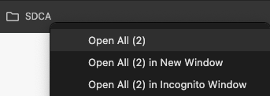

<br>
<br>
<br>

## Introduction:
- The purpose of this document is to guide you through setting up automated TradingView alerts that update your SDCA spreadsheet.
- We will cover the steps for each specific indicator scenario I’ve encountered so far.
- Before we dive into the details, there are a few preparations you need to make.
- Follow the steps outlined below to get started.

<br>

### Credits:
- This document builds on information previously shared by **@raphaelxsteel 🎖️**
- I will not be repeating content that has already been covered in previous discussions.
- Link to original message: 
  - https://app.jointherealworld.com/chat/01GGDHGV32QWPG7FJ3N39K4FME/01GKWY254XP3HKVF94YAAZ06KV/01J8TDTBSES8WJRAE6DVRN5AJR
- Link to original document:
  - https://docs.google.com/document/d/1I6cwsaIbfOHKWiCcOKMs40owS3cnjnnAuX18mRBL3nQ/edit?usp=sharing


<br>
<br>
<br>

### Expected End Result:

Here are the results I've achieved so far:

- I've successfully set up my **SDCA system** with a total of **16 indicators**.
  - **11 indicators** are automatically updated. _(each 1W, 1D, 12h or 1min - depends on indicator)_
  - Only **5 indicators** require manual updates by reviewing charts.
  - Manual updates involve reviewing the chart and entering today's value. 
  - The Z-score is then automatically calculated based on the predefined SD -2 and SD +2 values.
  - _(Using a pre-prepared TradingView template and Chrome bookmarks folder, it takes just 2 minutes per update.)_

<br>

<p align="center">
  
</p>

<br>

Example of using a Chrome bookmarks folder:
- Right-click the folder and select **"Open all"** to open all the bookmarked links for your indicators at once.

<br>

<p align="center">
  
</p>

<br>

<br>
<br>

Find TradingView indicator templates here:
- For additional help on how to use TradingView indicator templates, Google for more resources and guides.

<br>

<p align="center">
  
</p>

<br>

<p align="center">
  
</p>

<br>
<br>

<br>
<br>
<br>

### STEP 1: Create a new sheet in your SDCA spreadsheet
- Name the new sheet: `Automated TV Webhook` 
  - _`Automated TV Webhook` name is used later in code, unless you want to change the code, use the same name_
- In `Automated TV Webhook`, make the first row be frozen - always at top.
- In `Automated TV Webhook`, set column names according to second screenshot
- Column names: 
  - `Date`
  - `Indicator`
  - `SD -2`
  - `SD +2`
  - `Today's Value`
  - `Mean (µ)`
  - `Standard Deviation (σ)`
  - `Z-Score`
  - `Link / TV Template`

<br>

Sheet example:

<p align="center">
  
</p>

<br>
<br>

Columns example:

<p align="center">
  
</p>

<br>
<br>


### STEP 2: Google Spreadhsheet code
- Refer to "Credits" section if you don't know where to place this code.
- https://docs.google.com/document/d/1I6cwsaIbfOHKWiCcOKMs40owS3cnjnnAuX18mRBL3nQ/edit?usp=sharing

<br>

#### Summary of What You Need to Do:
Make sure you correctly define the `summary_cell` and `update_row` for each indicator based on your spreadsheet.

Replace **your_spreadsheet_id** with your actual Google Spreadsheet ID.

Update the time zone in the line that formats the date if you're in a different time zone from Riga. 

You can use AI tools or resources to help you adjust this for your local time.

**Z-Score Calculation:** The code automatically calculates the Z-score based on the `sd_minus_2`, `sd_plus_2`, and `todays_value`.

<br>

#### See more about the code below the code block.

<br>
<br>


## Google Spreadhsheet code

```
// Mapping of indicator names to their summary cell and update row
var indicatorToCell = {
  "Indicator1": { summary_cell: "I5", update_row: 2 },
  "Indicator2": { summary_cell: "I6", update_row: 3 },
  "Indicator3": { summary_cell: "I7", update_row: 4 },
  "Indicator4": { summary_cell: "I8", update_row: 5 },
  "Indicator5": { summary_cell: "I9", update_row: 6 },
  "Indicator6": { summary_cell: "I10", update_row: 7 },
  "Indicator7": { summary_cell: "I11", update_row: 8 },
  "Indicator8": { summary_cell: "I13", update_row: 9 },
  "Indicator9": { summary_cell: "I14", update_row: 10 },
  "Indicator10": { summary_cell: "I15", update_row: 11 },
  "Indicator11": { summary_cell: "I16", update_row: 12 },
  "Indicator12": { summary_cell: "I17", update_row: 13 },
  "Indicator13": { summary_cell: "I18", update_row: 14 },
  "Indicator14": { summary_cell: "I19", update_row: 15 },
  "Indicator15": { summary_cell: "I22", update_row: 16 },
  "Indicator16": { summary_cell: "I23", update_row: 17 },
};

function doPost(e) {
  try {
    // Parse the JSON data from the request body
    var data = JSON.parse(e.postData.contents);

    // Validate the required keys in the JSON data
    if (!data.indicator || data.sd_minus_2 === undefined || data.sd_plus_2 === undefined || data.todays_value === undefined) {
      return ContentService.createTextOutput(JSON.stringify({ 'result': 'error', 'message': 'Missing required keys in JSON data' }))
                           .setMimeType(ContentService.MimeType.JSON);
    }

    // Convert string decimals to numbers using parseFloat
    var sd_minus_2 = parseFloat(data.sd_minus_2);
    var sd_plus_2 = parseFloat(data.sd_plus_2);
    var todays_value = parseFloat(data.todays_value);

    // Get the current date and time in Riga/Europe time zone
    var currentDate = new Date();
    var formattedDate = Utilities.formatDate(currentDate, "Europe/Riga", "yyyy-MM-dd HH:mm:ss");

    // Calculate Mean, Standard Deviation, and Z-Score
    var mean = (sd_minus_2 + sd_plus_2) / 2;
    var standardDeviation = (sd_plus_2 - sd_minus_2) / 4;
    var zScore = (todays_value - mean) / standardDeviation;

    // Round the Z-Score to two decimal places
    zScore = Math.round(zScore * 100) / 100;

    // Open the spreadsheet
    var spreadsheet = SpreadsheetApp.openById("your_spreadsheet_id");
    var sheet = spreadsheet.getSheetByName("Automated TV Webhook");

    // Get the specific row and summary cell for the current indicator
    var cellInfo = indicatorToCell[data.indicator];

    if (cellInfo) {
      // Use the update_row for updating values instead of adding a new row
      var updateRow = cellInfo.update_row;

      // Set values in the specified row, starting from the first column (A)
      sheet.getRange(updateRow, 1).setValue(formattedDate);        // Set current date and time
      sheet.getRange(updateRow, 2).setValue(data.indicator);
      sheet.getRange(updateRow, 3).setValue(sd_minus_2);           // Use converted decimal values
      sheet.getRange(updateRow, 4).setValue(sd_plus_2);            // Use converted decimal values
      sheet.getRange(updateRow, 5).setValue(todays_value);         // Use converted decimal values
      sheet.getRange(updateRow, 6).setValue(mean);                 // Insert calculated Mean
      sheet.getRange(updateRow, 7).setValue(standardDeviation);    // Insert calculated Standard Deviation
      sheet.getRange(updateRow, 8).setValue(zScore);               // Insert rounded Z-Score

      // Update the summary cell for Z-score
      var summarySheet = spreadsheet.getSheetByName("SDCA v2");
      summarySheet.getRange(cellInfo.summary_cell).setValue(zScore);
    } else {
      // Handle case where indicator is not found in the mapping
      return ContentService.createTextOutput(JSON.stringify({ 'result': 'error', 'message': 'Indicator not found in mapping' }))
                           .setMimeType(ContentService.MimeType.JSON);
    }

    // Return success message
    return ContentService.createTextOutput(JSON.stringify({ 'result': 'success' }))
                         .setMimeType(ContentService.MimeType.JSON);

  } catch (error) {
    // Return error message if something goes wrong
    return ContentService.createTextOutput(JSON.stringify({ 'result': 'error', 'message': error.toString() }))
                         .setMimeType(ContentService.MimeType.JSON);
  }
}
```

<br>
<br>

#### Code summary:
This code processes JSON data sent to it via a POST request, 
performs calculations based on the data, and updates a Google Spreadsheet with the results. 

Specifically, it's designed to handle indicators from TradingView, calculate Z-scores, 
and update two different sheets: 

one for detailed data **Automated TV Webhook** and one for a summary **SDCA v2**.

<br>

#### Indicator Mapping (indicatorToCell):

This is a dictionary (mapping) that links the name of each indicator (e.g., "Indicator1") to two important pieces of information:
- `summary_cell`: The cell in the **SDCA v2** sheet where the calculated Z-score will be placed.
- `update_row`: The row in the **Automated TV Webhook** sheet where detailed data for the indicator will be updated.

**Important:** You need to make sure that the `summary_cell` and `update_row` are correctly defined for your spreadsheet.

<br>

#### Automatic Updates to the Spreadsheet:

The code opens a Google Spreadsheet using a unique identifier `your_spreadsheet_id`, 
**which needs to be replaced with the actual ID of your spreadsheet.**

Based on the data sent (which includes the indicator name, sd_minus_2, sd_plus_2, and todays_value), 
the code finds the corresponding cells and rows to update.

<br>

#### The "update_row" Mechanism:

For most cases, you won’t need to modify the update_row values.

They map directly to the correct rows in the "Automated TV Webhook" 
sheet and will likely work as expected unless your sheet structure changes.

<br>

#### Z-Score Calculation:

<p align="center">
  
</p>

<br>

#### Time Zone Formatting:

The line `var formattedDate = Utilities.formatDate(currentDate, "Europe/Riga", "yyyy-MM-dd HH:mm:ss");` 
converts the current time to a specific format and time zone (Riga time).

**Important:** You may need to adjust this to match your local time zone. 

If you’re unsure how to do that, you can use AI tools to help you find the correct format for your time zone.

<br>
<br>
<br>

### STEP 3: TradingView Alerts (Example 1)
- Modifying TradingView Indicator to Strategy for Alerting
- This method applies when you have access to the indicator code.

<br>
<br>

1. **Open the indicator code** in the TradingView editor.
2. **Modify** the `indicator()` function at the top of the code by changing it to the `strategy()` function.
   - The `strategy()` function provides access to alerts that can send JSON-formatted data.
3. **Add** an `alert()` function call with your desired data at the end of the indicator code.

<br>

Change `indicator()` function:

```pine
indicator(title="Indicator", shorttitle="Indicator", format=format.price, precision=4, timeframe="", timeframe_gaps=true)
```

To `strategy()` function:

```pine
strategy("SDCA: Indicator", overlay=true, initial_capital = 10000, default_qty_type = strategy.percent_of_equity, default_qty_value = 100.0, commission_value = 0.10)
```

Example:

<p align="center">
  
</p>

### Alert Code Example

- **Replace** `Indicator1` with the appropriate names you've defined in the sheet code for `indicatorToCell`.
- **Ensure** you use the correct variables to represent `sd_minus_2`, `sd_plus_2`, and `todays_value`.
- **Configure** the alert to send updates at intervals based on the nature of your indicator. Options include:
  - `1W` (Weekly)
  - `1D` (Daily)
  - `12h` (Every 12 Hours)
  - `1min` (Every Minute)
- **Note**: Most of my alerts are set to `1min` or `1D` to receive the latest updates as frequently as possible. However, if your indicator provides inaccurate data at lower timeframes, you may need to stick with `1W`

```pine
alert(message='{"indicator": "Indicator1", "sd_minus_2": "' + str.tostring(variable1) + '", "sd_plus_2": "' + str.tostring(variable2) + '", "todays_value": "' + str.tostring(variable3) + '"}', freq=alert.freq_all)
```

<br>

Example:

<p align="center">
  
</p>

Once you've made the code changes, follow these steps:

1. **Save** the updated indicator.
2. **Find** your desired symbol (e.g., `BTC:INDEX`) and select a timeframe.
3. **Locate** your indicator from the list of saved indicators, or add it to the chart manually.
   - Ensure you are using the edited version of the indicator.
4. **Select** a timeframe, starting with `1min` and gradually increasing to `12h`, `1D`, or `1W` if needed.
   - Choose the lowest possible timeframe that maintains accurate data results from the indicator.
   - Be cautious with lower timeframes like `1min` or `5min`, as they can sometimes cause alerts to send incorrect or misleading data. This can happen if your indicator isn't optimized for lower intervals, leading to fluctuations or unexpected values in the alerts.
   
**Tip**: If your indicator produces incorrect data or behaves unexpectedly on lower timeframes, move up to a higher timeframe. This will help preserve the accuracy of your alerts and the integrity of your SDCA system.

<br>

### Setup Alert

<p align="center">
  
</p>

- **Select** `Condition` -> Choose your indicator from the list.
- **Set** `Alert()` -> Choose **alert() function calls only** to trigger alerts based on the custom function.
- **Set Expiration** -> Choose the latest possible expiration date to keep the alert active long-term.
- **Alert Name** -> Set this to something like `SDCA: Indicator` _(replace `Indicator` with your indicator name)_
  - _(Alert name is for your own reference to easily identify what the alert is for)._


<p align="center">
  
</p>

- **Switch** to the **Notifications** tab.
- **Check** only the **Webhook URL** option.
- **Enter** your sheet URL as the **Webhook URL**.
- If you're unsure of your **Webhook URL**, refer to the **Credits** section at the top of this document.
- In the **Credits** section, you'll find a link to the original document this one is based on, which explains how to obtain the **Webhook URL**.

<p align="center">
  
</p>

- **Return** to your SDCA sheet.
- **Check** the **Automated TV Webhook** sheet to verify if you're receiving alert updates.

<br>
<br>
<br>

### STEP 4: TradingView Alerts (Example 2)
- **No access to the TradingView indicator code.**
- However, the indicator is set up so that you have access to plot values within the alerts.

<br>

#### Disclaimer
- I can't predict if this setup will work for your specific indicator.
- If you don't have access to the code, you'll need to experiment with the alerts to see if they can send the correct values to your SDCA sheet.
- Follow the steps below to set up an alert with plot variables and check if it works.

<p align="center">
  
</p>

<br>

#### Steps to Set Up the Alert

1. **Find** your indicator and add it to the chart.
2. **Select** your desired timeframe (start with `1min` to test, if it doesn't send proper values, switch to `1D` or higher).
3. **Select** `Condition` -> Choose your indicator from the list.
4. Next to `Condition`, there will be a `Plot` option, which represents some value generated by the indicator.
   - I've selected `Plot` here to trigger updates every minute.
5. **Set up a condition** that triggers on every minute to ensure no updates are missed.
   - Set the `Value` for the `Condition` to `0.00`.
6. **Select** `Trigger` -> Choose **Once per minute** or **Once per bar close** (depending on your timeframe and indicator).
7. **Set Expiration** -> Choose the latest possible expiration date to keep the alert active long-term.
8. **Alert Name** -> Name the alert something like `SDCA: Indicator` (replace `Indicator` with your indicator's name).
   - _(This is for your own reference to easily identify what the alert is for)._
9. **Message** -> Set the message to JSON formatted data containing your plot variables (see the example below).

<br>

```json
{
  "indicator": "Indicator",
  "sd_minus_2": "{{plot_3}}",
  "sd_plus_2": "{{plot_2}}",
  "todays_value": "{{close}}"
}
```

<br>

10. **Switch** to the **Notifications** tab.
11. **Check** only the **Webhook URL** option.
12. **Enter** your sheet URL as the **Webhook URL**.

<br>

From TradingView docs:

```
{{plot_0}}, {{plot_1}}, ... {{plot_19}} 

- corresponding output series of an indicator used in the alert. 

Note that the plots are numbered from zero. 

The highest plot ID is 19 (you can access only 20 first output series). 

Output series are the values of an indicator you can see on a chart. 

For example, the built-in volume indicator has two output series: 
- Volume and Volume MA. 
- You can create an alert on it and type in a message box something like this:

Volume: {{plot_0}}, 
Volume average: {{plot_1}}
```

<br>
<br>
<br>

### STEP 5: TradingView Alerts (Example 3)
- **No access to the TradingView indicator code.**
- You hardcode the `sd_plus_2` and `sd_minus_2` values, but use one value from the indicator, such as `{{plot_0}}` or `{{close}}`.

<br>

```json
{
  "indicator": "Indicator",
  "sd_minus_2": "95.00",
  "sd_plus_2": "5.00",
  "todays_value": "{{plot_0}}"
}
```

```json
{
  "indicator": "Indicator",
  "sd_minus_2": "95.00",
  "sd_plus_2": "5.00",
  "todays_value": "{{close}}"
}
```

<br>

<p align="center">
  
</p>


<br>
<br>
<br>
